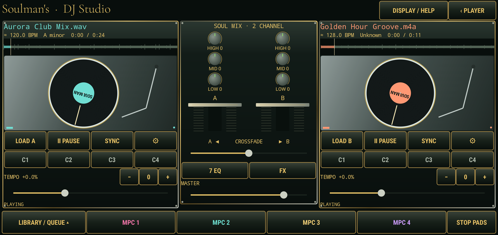
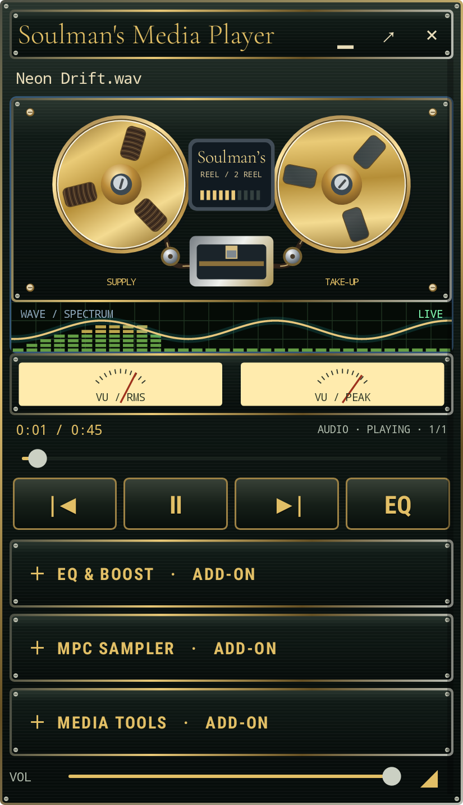

# Soulman's Media Player — DJ Studio & Gold Rack 10.0

A personal, ad-free Android audio and video player with Soulmans artwork, optional boost, a seven-band equalizer, four sample pads, live recording, music-reactive visuals, and a draggable floating mini player. Android 8.0 or newer. No account, ads, analytics, or internet permission. Audio recording and Display over other apps access are optional and requested only when you choose those features.

## Download

- [Install the Android APK](Soulmans-Sound-Booster.apk)
- [Download the Android Studio source](Soulmans-Sound-Booster-source.zip)

Download the APK on the phone and open it to install. Version 10.0 uses the existing signing certificate and updates earlier Soulmans installs. The app button now reads **Soulman's Media Player**. The download filenames remain the same for existing links.

## New in 10.0

- Larger adaptive launcher icon: the same transparent excited face and oversized headphones fill more of the app button. Launcher masks may crop the headphone edges.
- File/folder selection immediately plays the selected media. A library rescan keeps the current song playing. Existing saved rack sections remain collapsible.
- Video pinch zoom (1–10×) and one-finger panning operate on a stationary touch layer. Double tap opens fullscreen. Rotating the player to landscape opens fullscreen video; that fullscreen surface survives portrait/landscape rotation and keeps playback and framing.
- **VIDEO & AUDIO SETTINGS** opens brightness, saturation, hue, contrast, reset framing, EQ, optional boost, pitch, speed, and IN/OUT looping. Picture settings and speed are saved per file. 0.25–8× supports audio; above 8× to 50× disables audio for fast scanning. High speeds may drop frames depending on the phone and codec. Picture changes currently affect playback; the existing clip export saves the trim at normal speed without these playback effects or zoom.

## Fullscreen DJ Studio



Tap **DJ · TWO DECKS & MIXER** on Now Playing. The console rotates into landscape and pauses the ordinary music player. Two independent decoded audio transports feed a single stereo output:

- **LOAD A/B**, **PLAY**, actual forward/reverse vinyl scratching, whole-track waveforms you can drag to seek, and independent tempo sliders from 0.5–2×. Drag the record clockwise/counterclockwise to scrub the sound; release to resume the deck's previous playback state. Tempo uses vinyl-style varispeed: pitch changes with tempo.
- Center mixer: independent HIGH/MID/LOW controls, complete seven-band EQ ±6 dB and presets per deck, channel faders, equal-power crossfader, master volume, pre-gain, beat-length echo and high/low-pass filters. Audio is softly limited above the headroom threshold.
- **SYNC** matches the other deck's BPM × tempo when both tracks have usable BPM values. Optional experimental beat-phase alignment is in **DISPLAY / HELP**. Use ± buttons for small tempo changes and 0 to reset. BPM can be corrected manually, tapped in, halved, or doubled in the deck's ⚙ options.
- C1–C4 hot cues: first tap saves the current point; later taps jump and play. Hold a cue to replace it. Cue positions are remembered per track and deck. Deck settings provide IN/OUT sliders, IN NOW / OUT NOW, a four-beat loop and loop switch.
- **LIBRARY / QUEUE** expands a searchable browser and cue queue. Hold a song to drag it onto a deck or queue. Tapping also offers Load A, Load B or Add to queue. Queued tracks can load a deck, move up or be removed. The cue queue survives reopening and **SAVE QUEUE** stores it as an ordinary Library playlist.
- **ANALYZE** estimates BPM/key for library tracks locally from up to 90 seconds of sound. Loaded decks analyze automatically. Unknown/ambiguous results are shown honestly; estimates are approximate and can be corrected in ⚙. BPM, key and time displays can be hidden individually. Analysis metadata also appears in the ordinary library when available.
- Four colored **MPC** pads play the existing samples over both decks. Hold a pad to load an audio file or a video's audio stream, stop it, or open the existing trim/loop/record/effect/export editor. Gate, toggle and one-shot modes remain available. **STOP PADS** leaves the decks playing.
- The decks continue through file pickers and backgrounding with a DJ notification. **‹ PLAYER**, Back, or the notification's STOP MIX stops the DJ engine; the original player queue is retained. Calls, another app taking audio focus, or headphones disconnecting pause the decks.

DJ audio is decoded to private, temporary disk-backed PCM for real reverse scratching. Loading needs free phone storage and can take time on long files. Each deck accepts up to 512 MB of decoded stereo PCM; original files stay unchanged. The console uses the phone's output, including connected Bluetooth. Bluetooth adds latency; separate headphone cue routing and hardware-controller integration are not included. This is an original Soulman console, not a Serato/Pioneer/Rane product or replica of their software.

## Modular gold reel player



- The full and floating players use a compact, stacked audio rack with a dark anodized face, polished gold reels, gold controls, brushed metal detail, and silver fastening points. The **Soulman's Media Player** nameplate and excited-face icon remain. The bundled Cormorant Garamond font is licensed under the SIL Open Font License, included in `app/src/main/assets/fonts/OFL.txt`. Font source: [Google Fonts](https://github.com/google/fonts/tree/main/ofl/cormorantgaramond).
- Tape moves through the guides while the gold reels rotate. The supply tape pack shrinks and the take-up pack grows through the reel openings as the song progresses. The combined tape area stays constant, the smaller pack spins faster, seeking updates the packs, and pausing stops the mechanism.
- Green digital track readouts, a gold live waveform, colored spectrum bars, and analog **RMS / PEAK** needles use the decoded audio. No microphone is needed for these displays.
- **Tap a section heading to open or fold it.** Each section remembers its open state. The full rack has **EQ & BOOST**, **WAVEFORM / ZOOM & PAN**, **MPC SAMPLER & RECORDER**, **ARTWORK & VIDEO**, **VISUALS / SCREENSAVERS**, and **PLAYLISTS / FILES & HISTORY**. These are included features; there is nothing extra to install.
- The mini rack expands **EQ & BOOST** directly in the window: boost and EQ switches, gain, seven metal faders, and a preset button. Tap the preset button to cycle Flat, Bass, Vocal, Bright, Rock, Electronic, and Acoustic. Moving a fader selects Custom. **PITCH & SOUND OPTIONS** opens the full sound page.
- The mini rack's **MPC SAMPLER** expands four working pads. Tap a loaded pad to trigger it, hold to edit, or tap an empty pad to open loading/recording options. One-shot, toggle, and gate modes use the same saved samples as the full player. **STOP ALL** stops the pads while the song keeps playing.
- **MEDIA TOOLS** opens the full waveform editor, recording options, saved playlists, visual screensavers, video/artwork display, and video loop/export editor. The requested panel opens directly and the existing music queue and position are retained. Recording only begins after choosing options and granting the Android permissions.
- The floating window grows when sections expand. When the stack exceeds the phone's screen, scroll its contents; the title bar stays available for dragging, folding, returning, or closing. Video fills the mini display and retains pinch/drag/fullscreen. In the full rack, the video panel moves to the top while video is playing.
- Album artwork, the speaker-blast portrait, playlists, history, waveform navigation, pitch, boost, EQ, sample effects, recording, and video export remain available.

## Waveform zoom and pan

Open **WAVEFORM / ZOOM & PAN** in the full rack, or **MEDIA TOOLS → WAVE / PAN** in the mini rack.

- The song waveform and MPC sample editor now have **+ / −** zoom buttons, from 1× to 128×. Peaks load at higher resolution so zoom reveals more of the recorded volume envelope.
- **FULL SONG** (or **FULL FILE** in the sampler) shows the entire WAV. This is the initial view when loading a file.
- **DEFAULT** shows about 30 seconds around the current playhead, or around the sample's IN point. Short files fit in full; very long files are limited to 128× magnification.
- The **pan slider directly under the waveform** scrolls through the file. Its rectangular handle shrinks in proportion to the visible time range as zoom increases, with a minimum size for easy dragging. Tap elsewhere on the slider to move the window there. At full view it fills the slider and is disabled. Arrow keys and accessibility slider actions also move the window.
- The readout shows zoom and the visible start/end times. Panning never seeks audio or changes sample trim points. Tapping or dragging the song waveform seeks to the time under your finger within the displayed window.
- The playhead and sample IN/OUT markers follow the visible time range. Playback does not automatically move your chosen view. These navigation controls use PCM WAV peaks; unsupported WAV encodings show a message and disabled waveform controls. The ordinary track seek bar remains available for other formats.

## Excited face app icon

The launcher button now uses Soulmans' huge smiling face, red cap, sunglasses, and oversized neon cyan headphones. The PNG has a real transparent background around the head, and the launcher resource uses the cutout directly without an opaque background layer. Android launchers may apply their own mask or background to app buttons. The speaker-blast player background remains available in the app.


- [Transparent icon PNG](Soulmans-Excited-Face-icon.png)
- [Artwork generation prompt](Excited-icon-prompt.md)

## Floating mini player

- Tap **MINI PLAYER** on Now Playing, or **OPEN FLOATING MINI PLAYER** in Sound. On first use, enable **Display over other apps** for Soulmans in Android Settings, then return to the app. The full app moves into the background and a compact player floats over your other apps.
- The compact dark and gold frame has animated tape reels, a nameplate, analog level meters, digital readouts, and expandable rack sections. Music shows the decoded waveform and spectrum below the reels; it uses no microphone. Videos replace the music deck with the playing video.
- **Drag the title bar** to move the rectangle. **Drag the bottom-right corner sideways** to resize it. Its size and position are remembered; the frame stays inside the screen bounds. **▁** folds it into a small title bar with a play/pause button; **▣** opens it again.
- Previous, play/pause, next, seek, and device-volume controls act on the same player and queue. **EQ** expands boost and EQ inside the mini player. **PITCH & SOUND OPTIONS** opens the full sound page. **↗** returns to the full player. **×** closes only the floating window; playback continues. The ongoing mini-player notification also has a close action.
- Videos retain pinch-to-zoom, drag-to-frame, and double-tap fullscreen inside the preview. Move the whole window using the title bar. Video and music keep their position when switching between the full and mini player.
- Android can hide overlays on protected screens, permission dialogs, or the lock screen. If Display over other apps is revoked, the mini window closes. It never opens automatically at boot.

## Listening

- **Files / Folder:** choose audio or video files, multiple files, or a folder and its subfolders using Android Files. Access is remembered. Android restricts some system folders; choose a media subfolder instead.
- **Library:** tap a track to play. Hold it for Play next, Add to queue, Add to playlist, or Remove from library. Removing a track never deletes its original audio file.
- **Lists:** save the current queue, create or rename playlists, add or remove tracks, and delete playlists. The library, lists, play counts, and history stay on this phone.
- **Queue:** hold a track to move it up/down or remove it. Shuffle and repeat-one/repeat-all are available on Now Playing.
- **History:** the latest 200 playback starts, timestamps, and lifetime play counts. Pausing and resuming a loaded track does not add another play. History can be cleared from the library menu.
- Queue and playback position are remembered. Reopening restores the queue paused. Position is saved every five seconds and on playback changes.
- Playback continues with the screen off and has notification, lock-screen, and Bluetooth media controls.

## Player and samples

- Drag the progress bar to seek. Video plays in the artwork window or fullscreen. Pinch to zoom, drag to frame the picture, and double tap for fullscreen. The video clip editor saves IN/OUT points per video, loops that range during playback, and exports a separate MP4 or 3GP clip at original size, 1080p, 720p, or 480p. Video exports use H.264/AAC; device encoder support may vary. The source stays unchanged.
- PCM WAV tracks and samples also show peak-volume waveforms. On a track, tap or drag the waveform to seek. In the pad editor, the waveform shows the selected trim region and its start/end markers.
- **Four sample pads:** tap an empty pad to choose an audio file. Tap a loaded pad to play it; one-shot, toggle, and gate triggers are available. All four can overlap with a song or play on their own. Hold a pad to edit it. Stop All stops every pad. Sample volume is adjustable in Sound.
- **MPC sample editor:** trim a sample's start and end with sliders, enable looping with a checkbox, and see volume peaks with IN/OUT markers for PCM WAV. Adjust pitch, fade-in, fade-out, echo mix, and echo delay per pad. Preview the edited slice or export it as a separate 16-bit PCM WAV (up to 60 seconds); the source file stays unchanged.
- **Pitch:** choose -12 to +12 semitones in half-step increments. Pitch is saved per track while tempo stays the same.
- **Visuals:** neon spectrum, electric waveform, orbital pulse, or artwork glow. The visualizer reads the decoded music signal without recording the microphone. A small overlay appears after four seconds without touch. Tap Visuals for fullscreen; optionally enter fullscreen after 15 seconds. Tap anywhere to leave.

## Boost and EQ

- Player boost is optional, 0–12 dB, applied to the player's audio with a soft limiter to reduce hard clipping. The speakers and already-loud recordings still impose physical limits.
- Seven software EQ bands: 60, 150, 400, 1k, 2.5k, 6k, and 12k Hz, each ±6 dB. Presets: Flat, Bass, Vocal, Bright, Rock, Electronic, and Acoustic, plus Custom. Boost and EQ each have a separate switch and are initially off.
- **Other apps boost** retains the original experimental global audio effect. It pauses this player; starting player playback switches global boost off to avoid stacked processing. Support depends on the phone and output route. It does not boost phone calls.

## Record into the sampler

- Tap **RECORD** on the MPC deck, or **RECORD NEW TAKE** in a pad's editor. Choose **Phone audio** or **Microphone**, a destination pad, 44.1 or 48 kHz WAV quality, an optional three-second countdown, and a maximum of 15 seconds, 30 seconds, 60 seconds, or five minutes. Saving earlier is always available.
- **Phone audio** requires Android 10 or newer. It records stereo media/game playback from apps that allow Android playback capture, including this player's audio. Android asks for audio-recording permission and displays its capture consent prompt for each new session. Only audio is written; the app does not create a screen recording. Apps can block capture, and protected audio or calls are not guaranteed to be recordable. The input meter and a no-signal message help identify silence.
- **Microphone** records a mono WAV from the microphone Android selects. Use headphones when playing music if you want to reduce speaker bleed. Microphone access starts only after you press Start Recording and grant permission.
- The live recorder shows the input level, elapsed time, **PAUSE / RESUME**, and **SAVE / STOP**. Pause skips incoming audio. Recording continues when you switch to another app or turn off the screen; its ongoing notification lets you return, pause, or save. Android can stop recording if capture permission is revoked or the input becomes unavailable.
- **SAVE / STOP** loads the take into the chosen pad, ready for waveform trim, loop, trigger, pitch, fade, and echo editing. Every completed take also remains in **SAVED TAKES** so you can reuse it in another pad or **save the original WAV to Files**. The edited WAV export still allows clips up to 60 seconds; original recorded takes can be exported at their full recorded length.
- Takes are stored privately on this phone and are removed if the app is uninstalled or its data is cleared. Export important takes to Files for a separate copy. No recordings are sent to a server. A recoverable draft is kept if Android interrupts a recording.

## Formats and file access

Common Android-supported audio formats include MP3, AAC/M4A, FLAC, WAV, Ogg/Vorbis, Opus, and AMR. Common video containers include MP4, WebM, MKV, MOV, and 3GP when the device has a compatible codec. Android codecs vary by device, so no player can guarantee every codec, damaged file, or DRM-protected file. Unsupported or inaccessible files show an error. The waveform view reads uncompressed PCM WAV; compressed WAV variants can still play if Android can decode them, but may not get the peak view. MIDI, WMA, AIFF, and unusual encodings depend on the device and may be rejected.

The app remembers document permissions, not copies of music files. If a file moves, a storage card is removed, or a provider revokes access, re-import it. Saved folders can be rescanned from the Library menu. Cloud document providers may use their own network connection; this app itself is offline.

## Build

Java 17, Gradle 8.13, Android Gradle Plugin 8.13.2, SDK 35, min SDK 26, target SDK 34, Media3 1.8.0.

```text
gradlew.bat assembleDebug
gradlew.bat testDebugUnitTest lintDebug
gradlew.bat connectedDebugAndroidTest
gradlew.bat assembleRelease
```

Set `ANDROID_HOME` to an Android SDK or use an Android Studio `local.properties`. The application ID remains `com.cleargain.app`, version code is 13, and the delivered APK uses the existing signing certificate so it can update earlier versions. The private signing key is excluded from the public source ZIP. A new source checkout uses a new debug key unless the owner's existing key is supplied as `app/debug.keystore`; an APK signed with another key cannot replace an existing install.

Media3 ExoPlayer and MediaSessionService provide decoding and background media controls. Storage Access Framework handles file and folder selection. SQLite stores tracks, playlists, and history. A custom PCM processor supplies the EQ, gain, limiter, and frequency analysis.

Official references: [Media3](https://developer.android.com/jetpack/androidx/releases/media3), [background playback](https://developer.android.com/media/media3/session/background-playback), [supported formats](https://developer.android.com/media/media3/exoplayer/supported-formats), [Android audio playback capture](https://developer.android.com/media/platform/av-capture).

## Version 10.0 verification

The release build passed 31 unit tests and Android lint with no errors. Seven isolated Android emulator integration tests passed, covering file-selection autoplay, collapsed sections, adaptive-icon rendering, video pinch/pan and double-tap fullscreen, both rotation directions, visible video after rotation, native color adjustments, 0.25×/50× video speed, WAV/AAC DJ decoding, forward/reverse scratching, mixing, sync, cues, loops, AudioTrack output, the two-deck interface, and native track dragging into the saved cue queue. The existing floating-player and waveform tests also passed: reel animation, tape changes after seeking, mini EQ/boost, overlapping sample pads, panel handoff, dragging/resizing, video rendering, and waveform zoom/pan without changing trim points.

The previews are screenshots from the actual Android emulator with generated test media. This release has not been tested on a physical Galaxy S20 Plus. The published APK retains the original signing certificate and version code 13 for an in-place update.
